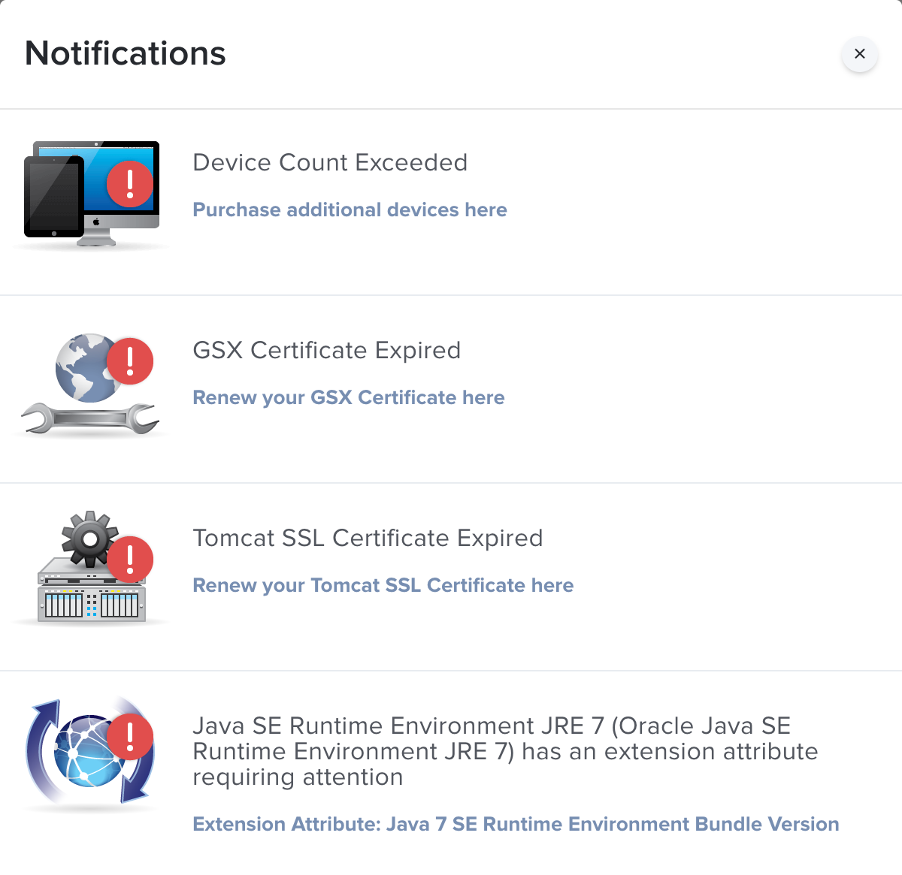
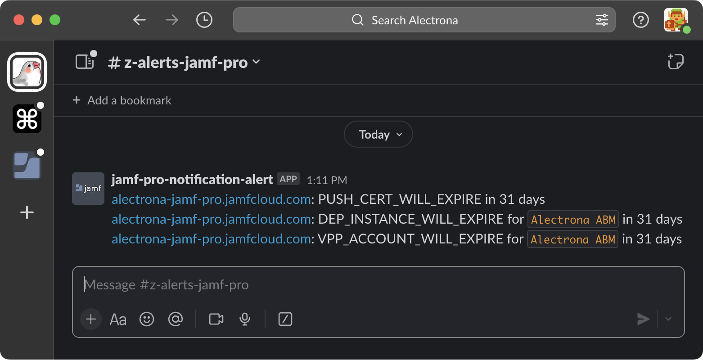

# Jamf Pro Notifications Alerter

A tool designed for CI/CD pipelines that gets all Jamf Pro Notifications from a Jamf Pro server and posts them to Slack using a webhook.


## Jamf Pro Notifications

Jamf Pro Notifications include (but are not limited to):
- Push certificate expirations
- Tomcat SSL certificate expirations
- DEP Terms and Conditions not signed

The below image is an example of the dialog that displays the Jamf Pro Notification details.

<center></center>

A static list of all of the Jamf Pro Notifications obtainable by API is included in [notifications.txt](notifications.txt).

Note: As Jamf adds more notifications, the above list of notifications will also need to be updated. The current available notifications are available from the Jamf link [here](#other-resources) by expanding the "200 Successful response" field.

## How to Run

Access the help with the `--help` option.

```sh
./jamf-pro-notifications-alerter.sh --help
```

```
OVERVIEW: A tool that retrieves Jamf Pro Notifications and posts them to Slack.

USAGE:
./jamf-pro-notifications-alerter.sh [--url] [--username] [--password] [--slack-webhook]

OPTIONS: 

--url               The Jamf Pro URL.
--username          The Jamf Pro API username.
--password          The Jamf Pro API password.
--slack-webhook     A Slack webhook to post the Jamf Pro Notifications to.

ENVIRONMENTAL VARIABLES:

The below Environmental Variables can be used in place of command line options.

JAMF_PRO_URL
API_USER
API_PASS
SLACK_WEBHOOK

Note: Using any of the above command line options will override that option's associated
environmental variable.
```

# See Notifications in Slack

When executed successfully, your Jamf Pro Notifications are posted to your specified Slack webhook including a link to the Jamf Pro server, the notification name, and optional token name and days until expiration. 🎉



# Ignoring Notifications

For any notifications you wish to ignore, you can comment them out in [notifications.txt](notifications.txt) by preceding that line with a `#`.

## Other Resources

- [Jamf API Reference - Get Notifications for user and site](https://developer.jamf.com/jamf-pro/reference/get_v1-notifications)
- [Slack API Reference - Sending messages using Incoming Webhooks](https://api.slack.com/messaging/webhooks)